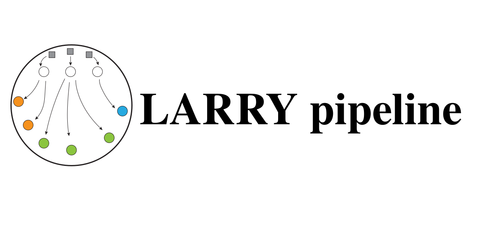
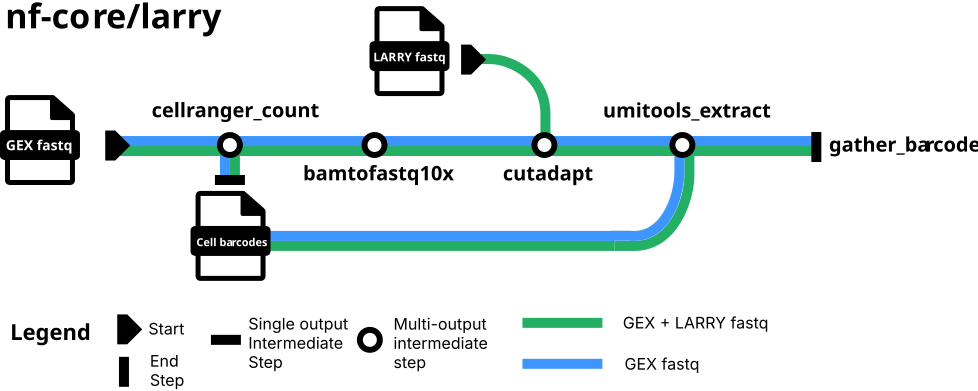

<h1>
  <picture>
    <source media="(prefers-color-scheme: dark)" srcset="docs/images/nf-core-larry_logo_2_dark.svg">
    
  </picture>
</h1>

[](https://github.com/nf-core/larry/actions/workflows/ci.yml)
[](https://github.com/nf-core/larry/actions/workflows/linting.yml)[](https://nf-co.re/larry/results)[](https://doi.org/10.5281/zenodo.XXXXXXX)
[](https://www.nf-test.com)

[](https://www.nextflow.io/)
[](https://docs.conda.io/en/latest/)
[](https://www.docker.com/)
[](https://sylabs.io/docs/)
[](https://cloud.seqera.io/launch?pipeline=https://github.com/nf-core/larry)

[](https://nfcore.slack.com/channels/larry)[](https://twitter.com/nf_core)[](https://mstdn.science/@nf_core)[](https://www.youtube.com/c/nf-core)

## Introduction

**nf-core/larry** is a bioinformatics pipeline that determines the clonal composition of cells. Cells have been labeled with (a) LARRY barcode(s). Clones are cells that originate from the same LARRY labelled cel (belong to the same lineage). The pipeline requires 10x Chromium Single Cell data (GEX) and paired-end Illumina sequences of PCR-enriched LARRY labels (LARRY). It takes a samplesheet and FASTQ files as input 

<p align="center">
    

1. Cellranger count module (GEX) ([`cellranger_count`](https://nf-co.re/modules/cellranger_count/))
2. Obtain the unmapped reads (GEX) ([`samtools_view`](https://nf-co.re/modules/samtools_view/))
3. Obtain reads mapped to the LARRY construct (GEX) ([`samtools_view`](https://nf-co.re/modules/samtools_view/))
4. Merge the unmapped and LARRY reads (GEX) ([`samtools_merge`](https://nf-co.re/modules/samtools_merge/))
5. Sort bam file (GEX) ([`samtools_sort`](https://nf-co.re/modules/samtools_sort/))
6. Convert 10x bam to FASTQ (GEX) ([`bamtofastq10x`](https://nf-co.re/modules/bamtofastq10x/))
7. Concatenate fastq files from same sample (GEX + LARRY) ([`cat_fastq`](https://nf-co.re/modules/cat_fastq/))
8. Remove adapter sequences (GEX + LARRY) ([`cutadapt`](https://nf-co.re/modules/cutadapt/))
9. Check for valid LARRY label (GEX + LARRY) ([`cutadapt`](https://nf-co.re/modules/cutadapt/))
10. Select first 28 nucleotides from the second read to obtain 10x barcode and UMI (CELLUMI) (GEX + LARRY) ([`cutadapt`](https://nf-co.re/modules/cutadapt/))
11. Filter LARRY and CULLUMI reads based on length (GEX + LARRY) ([`cutadapt`](https://nf-co.re/modules/cutadapt/))
12. Obtain cell barcodes from Cellranger that make the treshold (GEX) ([`gunzip`](https://nf-co.re/modules/gunzip/)) ([`cat_cat`](https://nf-co.re/modules/cat_cat/))
13. Extract UMI barcode from a read and add it to the read name (GEX + LARRY) ([`umitools_extract`](https://nf-co.re/modules/umitools_extract/))
14. Run bespoke script to obtain the LARRY label counts, determine cutoff and combine clone ids with multiple LARRY labels.

## Usage

> [!NOTE]
> If you are new to Nextflow and nf-core, please refer to [this page](https://nf-co.re/docs/usage/installation) on how to set-up Nextflow. Make sure to [test your setup](https://nf-co.re/docs/usage/introduction#how-to-run-a-pipeline) with `-profile test` before running the workflow on actual data.


First, prepare a samplesheet with your input data that looks as follows:

`input.csv`:

```csv
sample,fastq_1,fastq_2
sample1_GEX_1,AEG588A1_S1_L002_R1_001.fastq.gz,AEG588A1_S1_L002_R2_001.fastq.gz
sample1_GEX_2,AEG588A2_S1_L002_R1_001.fastq.gz,AEG588A2_S1_L002_R2_001.fastq.gz
sample1_LARRY_1,AEG588A3_S1_L002_R1_001.fastq.gz,AEG588A3_S1_L002_R2_001.fastq.gz
```

Each row represents a pair of fastq files (paired end).
Be aware! For the LARRY libraries: The first read needs to be the LARRY barcode and the second read the CELL + UMI barcode.

The sample name should be structured as follows:
1. Sample name
2. GEX/LARRY (depending on the library)
3. File number. Files with same sample name and GEX/LARRY should be enumerated: 1, 2, 3 ...

These three elements should be connected by an "_"

Clone the nextflow pipeline repository, go into the directory and switch to the dev branch.

```bash
git clone git@github.com:FrancisCrickInstitute/LARRY.git
cd LARRY/
git switch dev
```
Being in the nextflow pipeline directory, run the pipeline like this:

```bash
nextflow main.nf \
   --input <SAMPLESHEET> \
   --outdir <OUTDIR> \
   --cellranger_reference <CELLRANGER REFERENCE (absolute path)>
```

> [!WARNING]
> Please provide pipeline parameters via the CLI or Nextflow `-params-file` option. Custom config files including those provided by the `-c` Nextflow option can be used to provide any configuration _**except for parameters**_;
> see [docs](https://nf-co.re/usage/configuration#custom-configuration-files).

For more details and further functionality, please refer to the [usage documentation](https://nf-co.re/larry/usage) and the [parameter documentation](https://nf-co.re/larry/parameters).

## Pipeline output

To see the results of an example test run with a full size dataset refer to the [results](https://nf-co.re/larry/results) tab on the nf-core website pipeline page.
For more details about the output files and reports, please refer to the
[output documentation](https://nf-co.re/larry/output).

## Credits

nf-core/larry was originally written by Jasper Depotter.

We thank the following people for their extensive assistance in the development of this pipeline:

- Stephanie Strohbuecker
- Giulia Boezio


## Contributions and Support

If you would like to contribute to this pipeline, please see the [contributing guidelines](.github/CONTRIBUTING.md).

For further information or help, don't hesitate to get in touch on the [Slack `#larry` channel](https://nfcore.slack.com/channels/larry) (you can join with [this invite](https://nf-co.re/join/slack)).

## Citations

<!-- TODO nf-core: Add citation for pipeline after first release. Uncomment lines below and update Zenodo doi and badge at the top of this file. -->
<!-- If you use nf-core/larry for your analysis, please cite it using the following doi: [10.5281/zenodo.XXXXXX](https://doi.org/10.5281/zenodo.XXXXXX) -->

<!-- TODO nf-core: Add bibliography of tools and data used in your pipeline -->

An extensive list of references for the tools used by the pipeline can be found in the [`CITATIONS.md`](CITATIONS.md) file.

You can cite the `nf-core` publication as follows:

> **The nf-core framework for community-curated bioinformatics pipelines.**
>
> Philip Ewels, Alexander Peltzer, Sven Fillinger, Harshil Patel, Johannes Alneberg, Andreas Wilm, Maxime Ulysse Garcia, Paolo Di Tommaso & Sven Nahnsen.
>
> _Nat Biotechnol._ 2020 Feb 13. doi: [10.1038/s41587-020-0439-x](https://dx.doi.org/10.1038/s41587-020-0439-x).
